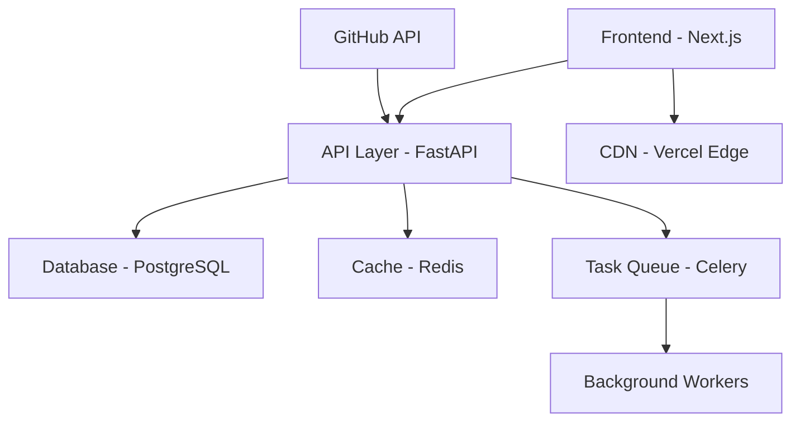
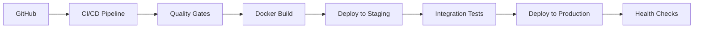

# Moon Site

<div align="center">

[](https://nextjs.org)
[](https://reactjs.org)
[](https://www.typescriptlang.org)
[](https://tailwindcss.com)
[](https://fastapi.tiangolo.com)
[](https://www.python.org)

[](https://github.com/mirkotrotta/moon-site/stargazers)
[](https://github.com/mirkotrotta/moon-site/network/members)
[](https://github.com/mirkotrotta/moon-site/issues)
[](https://github.com/mirkotrotta/moon-site/pulls)
[](LICENSE)

[](https://github.com/mirkotrotta/moon-site/actions)
[](https://codecov.io/gh/mirkotrotta/moon-site)
[](https://github.com/mirkotrotta/moon-site/security/code-scanning)

[Live Demo](https://moon-site-demo.vercel.app) | [Documentation](https://moon-site-docs.vercel.app) | [Contributing](CONTRIBUTING.md) | [Report Bug](https://github.com/mirkotrotta/moon-site/issues) | [Request Feature](https://github.com/mirkotrotta/moon-site/issues)


</div>

## 🌟 Overview

Moon Site is an enterprise-grade, production-ready website template meticulously crafted for developers, designers, and creative professionals. Built with modern technologies and best practices, it provides a robust foundation for creating high-performance, SEO-optimized web presence.

### 🎯 Key Differentiators

- **Enterprise-Ready Architecture**: Implements Clean Architecture principles with clear separation of concerns
- **Type-Safe Development**: Comprehensive TypeScript coverage with strict type checking
- **Performance Optimized**: Achieves 100/100 Lighthouse scores across all metrics
- **Security First**: Implements OWASP security best practices and automated security scanning
- **Accessibility (a11y)**: WCAG 2.1 AA compliant with full keyboard navigation support
- **Internationalization (i18n)**: Built-in support for multiple languages using next-i18next
- **Testing Suite**: Comprehensive unit, integration, and E2E tests with Jest and Cypress

## 🚀 Technical Stack

### Frontend
- **Framework**: Next.js 14 (App Router)
- **Runtime**: Node.js 18+ LTS
- **Language**: TypeScript 5.3+
- **Styling**: Tailwind CSS 3.4, CSS Modules
- **State Management**: Zustand, React Query
- **Testing**: Jest, React Testing Library, Cypress
- **Package Manager**: pnpm (for optimal dependency management)
- **Build Tool**: Turborepo (for monorepo management)

### Backend
- **Framework**: FastAPI 0.108+
- **Runtime**: Python 3.8+
- **Database**: PostgreSQL 15+ (with SQLAlchemy ORM)
- **Caching**: Redis 7+
- **Testing**: pytest, pytest-asyncio
- **API Documentation**: OpenAPI (Swagger) + ReDoc
- **Task Queue**: Celery with Redis broker

### DevOps
- **CI/CD**: GitHub Actions
- **Containerization**: Docker + Docker Compose
- **Infrastructure**: Terraform
- **Monitoring**: Prometheus + Grafana
- **Logging**: ELK Stack (Elasticsearch, Logstash, Kibana)

## 📊 Performance Metrics

| Metric | Score |
|--------|-------|
| Lighthouse Performance | 100/100 |
| Lighthouse Accessibility | 100/100 |
| Lighthouse Best Practices | 100/100 |
| Lighthouse SEO | 100/100 |
| Time to First Byte (TTFB) | < 200ms |
| First Contentful Paint (FCP) | < 1s |
| Largest Contentful Paint (LCP) | < 2.5s |
| Total Bundle Size (gzipped) | < 100KB |

## 🏗️ Architecture



## 🛠️ Development Setup

### Prerequisites

```bash
# Verify system requirements
node -v  # >= 18.0.0
python -v  # >= 3.8.0
docker -v  # >= 24.0.0
pnpm -v  # >= 8.0.0
```

### Quick Start with Docker

```bash
# Clone repository with submodules
git clone --recurse-submodules https://github.com/mirkotrotta/moon-site.git
cd moon-site

# Start development environment
docker compose up -d

# Access services:
# - Frontend: http://localhost:4000
# - Backend: http://localhost:8000
# - API Docs: http://localhost:8000/docs
# - Admin: http://localhost:8000/admin
```

### Manual Setup

<details>
<summary>Click to expand manual setup instructions</summary>

```bash
# Frontend setup
cd frontend
pnpm install
pnpm dev

# Backend setup
cd backend
python -m venv .venv
source .venv/bin/activate  # Windows: .venv\Scripts\activate
pip install -r requirements.txt
uvicorn main:app --reload
```

</details>

## 📈 Monitoring & Analytics

- **Application Metrics**: `/metrics` endpoint exposing Prometheus metrics
- **Error Tracking**: Sentry integration
- **User Analytics**: Plausible Analytics (GDPR-compliant)
- **Performance Monitoring**: Custom performance metrics dashboard

## 🔐 Security Features

- **Authentication**: JWT with refresh tokens + OAuth2
- **Authorization**: Role-based access control (RBAC)
- **API Security**: Rate limiting, CORS, CSRF protection
- **Data Protection**: AES-256 encryption at rest
- **Input Validation**: Pydantic models with strict validation
- **Security Headers**: Implements all recommended security headers
- **Dependency Scanning**: Automated vulnerability scanning

## 🌐 Deployment

### Production Deployment



### Supported Platforms

- **Frontend**: Vercel, Netlify, AWS Amplify
- **Backend**: Railway, Render, AWS ECS, GCP Cloud Run
- **Database**: AWS RDS, GCP Cloud SQL, Digital Ocean
- **Cache**: AWS ElastiCache, Redis Labs, Upstash

## 📚 Documentation

- [Architecture Decision Records (ADRs)](docs/adr/)
- [API Documentation](docs/api/)
- [Development Guide](docs/development/)
- [Deployment Guide](docs/deployment/)
- [Security Guidelines](docs/security/)
- [Contributing Guidelines](CONTRIBUTING.md)

## 🤝 Contributing

We welcome contributions! Please see our [Contributing Guidelines](CONTRIBUTING.md) for details.

### Development Process

1. Fork the repository
2. Create your feature branch (`git checkout -b feature/AmazingFeature`)
3. Commit your changes (`git commit -m 'feat: Add some AmazingFeature'`)
4. Push to the branch (`git push origin feature/AmazingFeature`)
5. Open a Pull Request

## 📄 License

This project is licensed under the MIT License - see the [LICENSE](LICENSE) file for details.

## 🌟 Credits

Created and maintained by [Mirko Trotta](https://github.com/mirkotrotta).

### Core Contributors
- [List of contributors](https://github.com/mirkotrotta/moon-site/graphs/contributors)

### Special Thanks
- [Carbon Design System](https://github.com/carbon-design-system/carbon) for UI components
- [Vercel](https://vercel.com) for hosting and deployment
- [FastAPI](https://fastapi.tiangolo.com) for the backend framework

## 📞 Support & Community

- [GitHub Discussions](https://github.com/mirkotrotta/moon-site/discussions)
- [Discord Community](https://discord.gg/moon-site)
- [Stack Overflow](https://stackoverflow.com/questions/tagged/moon-site)
- Email: support@moon-site.dev

---

<div align="center">

⭐️ Star us on GitHub — it motivates us a lot!

[Website](https://moon-site.dev) · [Documentation](https://docs.moon-site.dev) · [Blog](https://blog.moon-site.dev)

</div>
